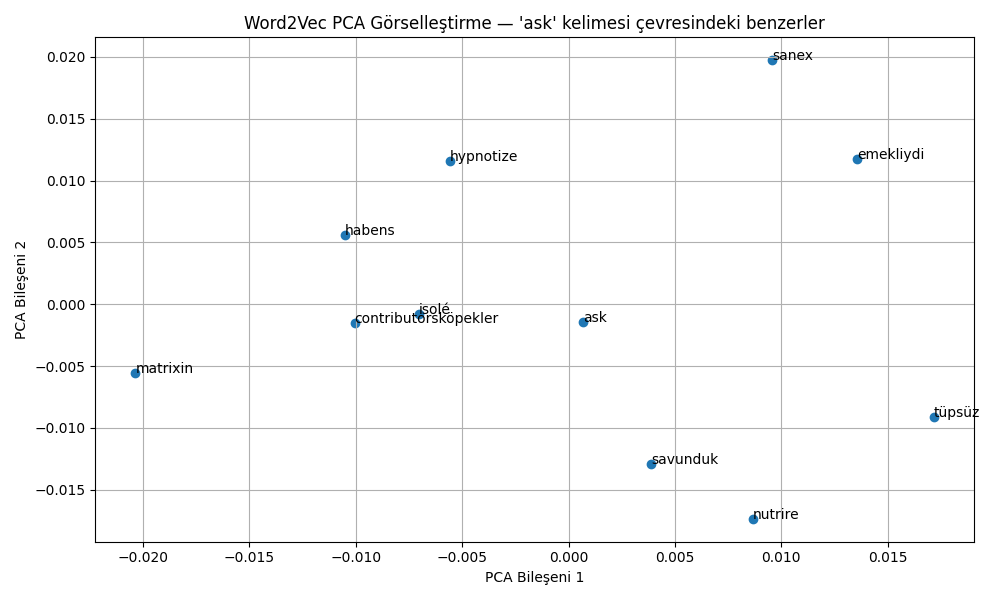

# 🎵 lyrics-nlp-analysis

Bu proje, Türkçe şarkı sözleri üzerinden **Doğal Dil İşleme (NLP)** yöntemleri kullanılarak analiz yapılmasını amaçlamaktadır. Projede hem **Lemmatization** hem de **Stemming** yöntemleriyle kelimeler üzerinde ön işleme yapılmış ve ardından **TF-IDF** ve **Word2Vec** teknikleriyle vektörleştirme uygulanmıştır. Son aşamada ise cümleler arası **benzerlik hesaplamaları**, **anlamsal değerlendirme** ve **model karşılaştırmaları** yapılmıştır.

---

## 📌 Proje Amacı

Bu proje kapsamında:

- Türkçe şarkı sözlerinden oluşan ham veri seti işlenmiştir.
- Veriler üzerinde **ön işleme**, **lemmatizasyon**, **stemleme** ve **vektörleştirme** adımları gerçekleştirilmiştir.
- TF-IDF ve Word2Vec ile her cümle vektörleştirilmiş, ardından cümleler arası benzerlik analizi yapılmıştır.
- Her modelin başarı durumu, **anlamsal puanlama (subjective evaluation)** ve **sıralama tutarlılığı (Jaccard benzerliği)** ile değerlendirilmiştir.

---

## 🧪 Gerekli Kurulumlar

Projeyi çalıştırabilmek için aşağıdaki Python kütüphaneleri gereklidir:

```bash
pip install nltk
pip install zeyrek
pip install trnlp
pip install matplotlib
pip install pandas
pip install scikit-learn
pip install gensim
🧾 Projeyi Çalıştırma Adımları
1️⃣ Ön İşleme
python temizleme_adim1.py
2️⃣ Lemmatization
python lemmatization_adim2.py
3️⃣ Stemming
python stemming_adim3.py
4️⃣ TF-IDF Hesaplama
python tfidf_lemmatized.py
python tfidf_stemmed.py
5️⃣ Word2Vec Model Eğitimi
python word2vec_lemmatized_cbow_win2_dim100.py
Tüm modeller .model uzantılı olarak models/ klasöründe yer alır.

6️⃣ Benzerlik Hesaplama ve Değerlendirme
python similarity_analysis.py
Sonuçlar results/ klasörüne yazılır.
📊 Değerlendirme ve Karşılaştırma
🔸 Anlamsal Değerlendirme
Her modelin önerdiği benzer cümleler, 1–5 arası puanlarla değerlendirildi.
Sonuçlara göre:

Skip-Gram, window=4, dim=300 konfigürasyonu en iyi sonucu verdi.

Lemmatize edilmiş veriler, stem’lenmiş verilere göre daha anlamlıydı.

Word2Vec, TF-IDF'e göre semantik olarak daha güçlüydü.

🔸 Jaccard Benzerliği
Modellerin sıralama tutarlılığı Jaccard Similarity ile ölçüldü.

📌 18x18 Jaccard matrisi ve analiz çıktıları results/ klasöründedir.
💾 Dosya Yapısı
Dosya/Klasör	                 Açıklama
lemmatize_tokenler.txt	    Lemmatize edilmiş kelimeler
stemmed_tokenler.txt       	Stemmed kelimeler
tfidf_lemmatized.csv	      TF-IDF çıktısı (lemmatize)
tfidf_stemmed.csv	          TF-IDF çıktısı (stemmed)
models/	                    Word2Vec modelleri
results/	                  Tüm analiz çıktıları
*.py	                      Python betikleri
*.ipynb	                    Notebook analizleri
*.png	                      Görselleştirmeler (PCA, Zipf vb.)


📈 Örnek Çıktılar
PCA ile Word2Vec Görselleştirmesi:
<p align="center">  </p>

👩‍💻 Geliştiren
Başak Şeriban Doğan
Gümüşhane Üniversitesi - Yazılım Mühendisliği 4. Sınıf Öğrencisi
